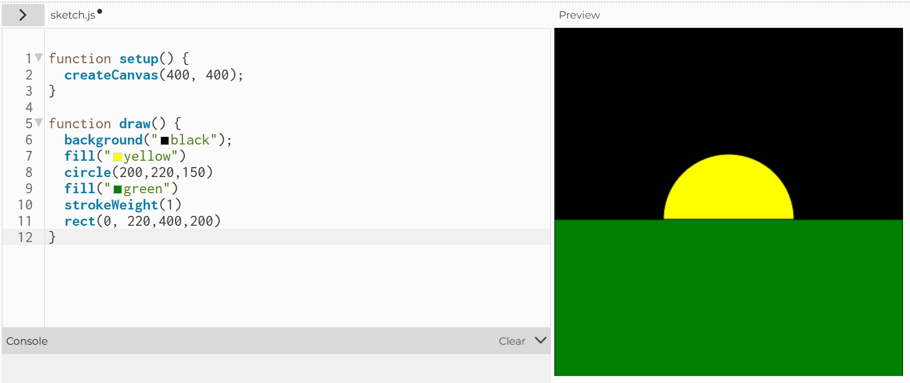

# Week 02 - Experiment 2: Interactive Data Portrait

[← Back to Home](../index.md)

## Studio Exercise

Activity 1: Drawing with Code

We were told to get familiar with the p5.js editor, creating a simple composition using at least three different shapes, and experimenting with colour, size, and position.

I did the basic one shown on screen, but also wanted to have a good idea of how to use most of the shapes so I did more than three and added some comments for notes about how the shapes worked.

*Shapes basic class example*

 *Activity 1 - Personal Extension Task*

Activity 2: Make an Interactive Sketch

For Activity 2 we were told to using the DOM elements covered in class (createButton(), createSlider(), createInput()), create a sketch with at least two interactive controls that change something on the canvas.

I used two DOM elements that were covered in class, createButton(), createSlider(), the button changed the colour of the circle, and the slider changed the size.

*Activity 2 Studio*

Activity 3: Vibe Code an Interactive Sketch

For this activity we were told to use an LLM (e.g. Gemini, ChatGPT, Claude) to help build a more ambitious interactive sketch in p5.js.

So I asked Copilot how to create a sketch that let me stamp circles on the page and would try to replicate the code it gave me without copying and pasting to gain a better idea of how to code, while still asking Copilot for help to understand why something was not working.

After I successfully did that I added another step onto each prompt after successfully completing the one new addition, colour randomisation, size randomisation, and how to make it so you could see the colour and size when hovering your mouse instead of only seeing it after stamping it on the canvas.

I learn that you always have to define what something is before using it for example, "let stamp=[]". 

*Activity 3 - Randomised Circle Stamp Colours/Sizes*

## Independent Study: Interactive Data Portrait
Overview

Step 1: Translate your data drawing into code

For this task I took the data that I collected for Experiment 1 and decided which pieces I wanted to represent in my p5.js sketch.

Looking at the data I wanted to represent how much and the type of liquid intake on different days in my p5.js sketch and decided to do this by using diffent colour stamps to represent the different types of drinks I drank and stamp them in a line to form columns to represent different days.and have people interact by stamping them in a line to form columns.

  
*p5.j3 Sketch for personal data visualisation*

I used Copilot to help me vibe code, as I knew how I wanted to display my data, I just needed help getting there, and making a few edits to the code given.

<video controls src="../assets/week-02/Microsoft 365 Copilot 2026-03-27 10-52-30.mp4" width="500" length="500" title="Copilot Vibe Coding"></video>  
*Copilot Vibe Coding* OpenAI. (2026). Copilot (Mar 20 version) [Large language model]. https://m365.cloud.microsoft/chat

Step 2: Design your interactive visualisation

For this step I make it so that people can interact with my  p5.js sketch using buttons and a stamp to add their own data to give the viewer control and add/make their own data, as well as reset the data, while keeping mine as an example.

*Interactive Data Demo*

The hand‑drawn data portrait from week 1 captures a fixed record of daily drink consumption, carefully mapping time, quantity, and drink type across the week. While this format makes the structure and chronology of the data clear, it remains static and also wasted a lot of space. 

The interactive visualisation introduces choice and agency, allowing the viewer to actively reconstruct the data by stamping each data point. This interaction highlights patterns of frequency, dominance, and absence more dynamically, as accumulation becomes visible through repeated action rather than pre‑drawn marks. Unlike the paper version, the digital sketch emphasises data as an ongoing process rather than a completed artefact.

The p5.js sketch has each button corresponds directly to the drink categories shown in the original paper legend (water, boba, tea bag, miso, lemonade). This mirrors the categorical colour‑coding used in the hand‑drawn chart, maintaining continuity between formats. However, while the paper version encodes time vertically and days horizontally, the digital version abstracts away from strict chronology. This shift reflects a change in focus — from documenting when each drink occurred to examining how often each category appears overall. The equal circle size reinforces that each mark represents a single, standardised data unit.

When a viewer clicks a button, the colour change is immediate, making the relationship between control and outcome clear. As more circles are stamped, patterns gradually emerge, sometimes revealing imbalances that were less noticeable in the hand‑drawn format. This layering effect can be slightly surprising, as meaning develops through interaction rather than predetermined layout. Compared to the paper portrait, which presents information in a resolved form, the interactive visualisation invites interpretation through participation, reinforcing the idea that data understanding can evolve through engagement rather than observation alone.

Step 3: Iterate

I tested this sketch on a friend, and watched them try to use it, after I realised that I didn't provide instructions and extra information on the interaction, so I added that to the interaction.

*Improvements to the Interaction*

## AI Usage Statement
As stated above, use of AI for vibe coding, M365 Copilot.