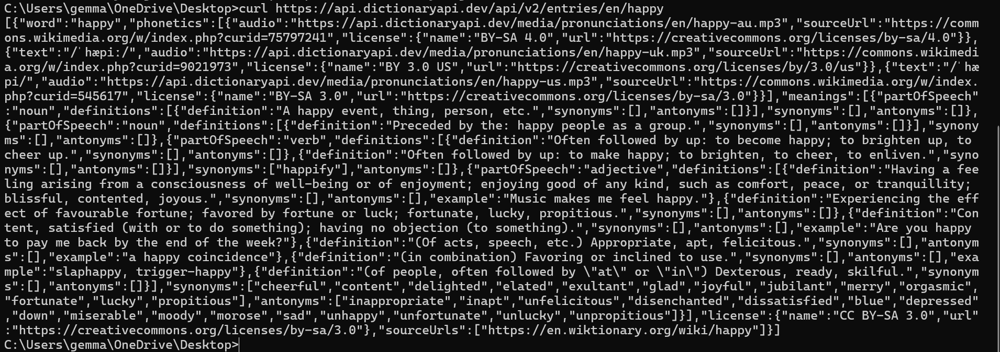
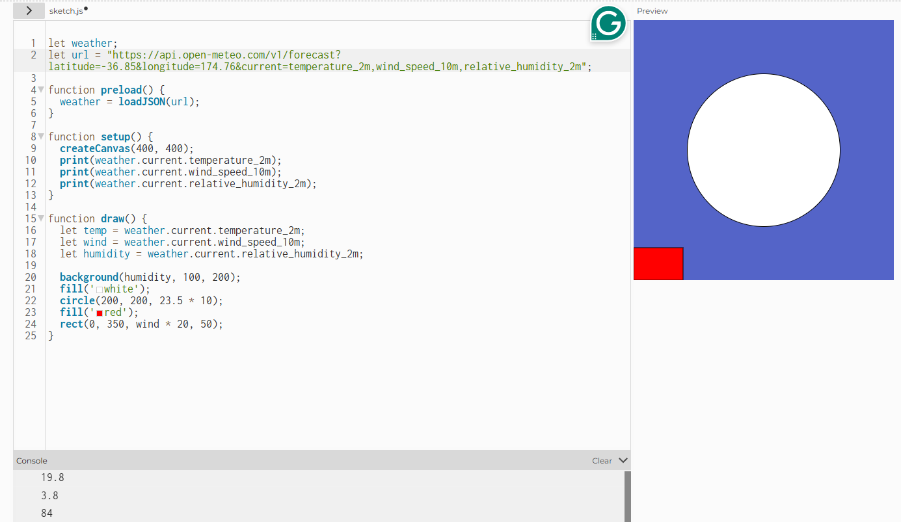
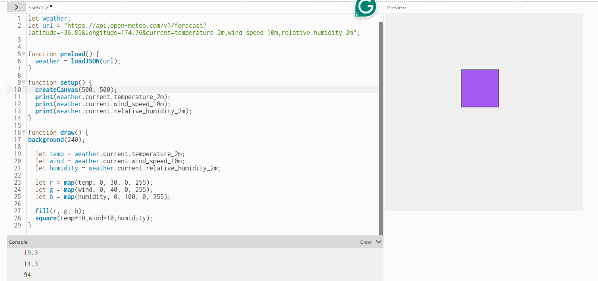
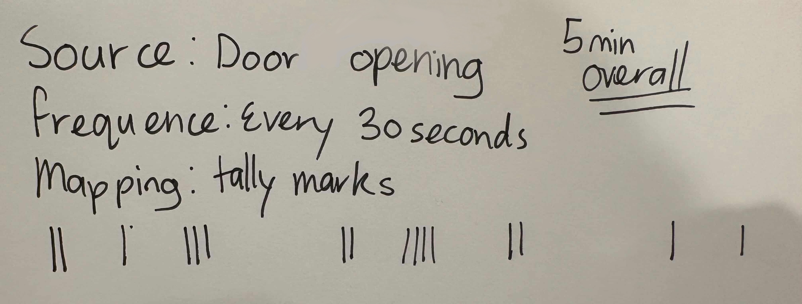

# Week 03 - Experiment 3: Live Data

[← Back to Home](../index.md)

## Studio Exercise
This week I was sick and completed the activities at home to the best of my abilities.
### Activity 1: Explore with cURL

Get the weather for a location using its GPS coordinates
  
*Weather in Taipei, Taiwan using GPS Coordinates using Command Prompt Terminal*

Get the weather in a different language
  
*Weather in Chinese using Command Prompt Terminal*

Get the current moon phase
  
*Moon Phase using Command Prompt Terminal*

Look up the synonyms and antonyms of a word
  
*Synonyms and Antonyms of the word "Happy" using Command Prompt Terminal*

Find something else in the documentation that we haven't covered
  
*Time of Dawn, Sunrise, Sunset using Command Prompt Terminal*

### Activity 2: Weather Visualisation

For this activity, I followed the instructions and opened the demo sketchLinks to an external site in the p5.js web editor. This sketch uses the Open-Meteo APILinks to an external site to fetch current weather data for Auckland and map it to visual properties.

  
*p5.js web editor weather*

After, it said to experiment with the sketch by:

Change the latitude and longitude to a different city and observe how the sketch changes. This made the shade of the background representinh the humidity darker and changed the sizes of the red rectangle and the white circle representing the wind speed and temperature respectively.

  
*Changed Latitude and Longitude*

After I experimented and used the data to control the colour, position and size of the shape which I changed to a square.

  
*Experimental Data Display*

Then I added the weather variables 'cloud cover' from the Open-Meteo API to add on and base the background colour on the cloud cover value.

  
*Cloud Cover Addition*

After, I tried using random() instead of the live data for one of the RGB values which resulted in the colour changing rapidly, never staying on one colour for too long.
<video controls src="../assets/week-03/Random.mp4" width="500" length="500" title="Adding Random() into the Sketch"></video>  
*Adding Random() into the Sketch*

Using vibe coding, I tried to make something more ambitious, which was adding in randomised shapes, and having them stay for longer than half a second.
<video controls src="../assets/week-03/Copilot reference vibe coding.mp4" width="500" length="500" title="Copilot reference vibe coding"></video>  
*Copilot Vibe Coding*   
OpenAI. (2026). Copilot (Mar 20 version) [Large language model]. https://m365.cloud.microsoft/chat

### Activity 3: Design and Execute a Data Protocol

Activity 3 was done in pairs, but as I was unwell, I did it by myself and found someone outside of class to test my set of rules for translating a live data source for the data protocal I designed. 

My protocol specified:

Source: doors opened
Frequency: every 30 seconds
Mapping: tally marks

I gave this to my friend to test in a five minute interval. They did interpret my rules as expected, the protocol was ambiguous in the ways that it did not specify which doors or which types of doors. I surprised me how many doors were open, despite all my family members being home, I did not expect doors in my door being opened that frequently.

## Independent Study: Live Data Visualisation

### Instructions:
Building on previous activities, create a work that engages with live data (data that is ongoing and changing). You can either take a digital approach, or an analogue/physical approach.

There were two options, A (Digital) or B (Analogue/Physical), I chose to do option A, build a p5.js sketch that responds to live data from an API.

I used a food recipe API to bring external data into my sketch. I tried to follow the structure of the weather API and used Copilot to help me with some minor issues.

*Copilot coding help for Recipe Randomisation*  
OpenAI. (2026). Copilot (Mar 20 version) [Large language model]. https://m365.cloud.microsoft/chat

I did not know how to get the API images and recipies onto the sketch so I asked Copilot then I worked around that and added buttons, playing around with font size and button size.

*p5.js Sketch for Recipe Randomisation*

#### Questions to consider:
- How do you map data values to visual properties?
- What does the visualisation reveal about the data that numbers alone cannot?
- How does the sketch change over time? What is the relationship between the data's rhythm and the visual rhythm?

Answers:  
In this sketch, data from the API is mapped to visual properties such as position, size, and imagery. The recipe name is displayed in a larger font at the top to show importance, while the category appears below in smaller text. The recipe image is scaled and positioned on the left to provide immediate visual context, and the instructions are placed on the right as wrapped text for readability. User interaction (clicking the random button) triggers changes in the visual output, linking the data directly to what appears on the screen.

The visualisation reveals qualities of the recipes that raw data cannot communicate on its own. Images instantly show the style and type of food, making differences between recipes easy to understand at a glance. The length and layout of the instructions visually indicate how complex a recipe is, and repeated randomisation highlights the diversity of cuisines and meal types available in the dataset. This makes the data more engaging and meaningful than viewing text or IDs alone.

The sketch changes over time through user interaction rather than continuous animation. Each press of the “Random Recipe” button triggers a new sequence of API calls, resulting in a complete visual update. The rhythm of the data is irregular and unpredictable due to random selection, and this randomness is reflected in the visual rhythm as sudden, noticeable changes in images and text. The visual updates directly mirror the timing and structure of the incoming data.

Through using the LLMs "Copilot" to help me, I learnt more about how to import text from APIs, instead of just data like what's the wind speed. It also taught me more about how to import images.

I took the digital approach because I understood it better and wanted to get a better grasp at how to use APIs. I worked with a food recipe and found them by googling "Free food recipe APIs" I decided that I wanted the format to be the standard format for recipies with the image towards the beginning to help give people a visual idea of what the food recipe's result would be.

My p5.js sketch relates to practitioners such as Conditional Design and Nathalie Miebach through its use of rules, systems, and data‑driven outcomes. Like Conditional Design’s approach, the sketch follows a clear set of conditions: data is fetched, randomly selected, and then visualised according to predefined rules. The final outcome is never fully predictable, which reflects their emphasis on process over fixed results. Similar to Nathalie Miebach’s translations of data into visual and physical forms, my sketch translates raw API data into a visual format that is more engaging and meaningful for users. While my work is digital rather than physical, it similarly focuses on making data experiential rather than purely numerical.

With more time, I would extend the project by adding more layers of data mapping and interaction such as, visualising ingredients as icons or using colour to represent different recipe categories. I would also explore allowing users to filter recipes by category or dietary preference, giving them more control over the data. These additions would deepen the relationship between the data and the visuals and make the experience more immersive.

Overall, this project helped me better understand how APIs can be used as creative tools rather than just sources of information. Working with live data introduced unpredictability, which made the sketch feel dynamic and aligned with generative art practices discussed in class. I learned that even simple visual choices such as layout, scale, and interaction, can significantly affect how data is perceived. Overall, the project reinforced the idea that data visualisation is not just about accuracy, but also about communication, experience, and design.

## AI Usage Statement
As stated above, use of AI for vibe coding and help with coding issues, M365 Copilot.